# Voucher Management API

Voucher Management API là ứng dụng backend viết bằng Spring Boot để quản lý voucher khuyến mãi, người dùng và lịch sử sử dụng voucher, tập trung vào thiết kế REST API, migration database, validate dữ liệu, xử lý nghiệp vụ ở service layer và tổ chức mã nguồn rõ ràng.

## Tính năng

- Quản lý voucher với đầy đủ thao tác CRUD.
- Tìm kiếm voucher theo mã code.
- Quản lý user với validate email và kiểm tra trùng email.
- Ghi nhận lịch sử sử dụng voucher.
- Tự động giảm số lượng voucher khi user sử dụng thành công.
- Từ chối sử dụng voucher khi voucher hết hạn, inactive hoặc hết số lượng.
- Trả response JSON thống nhất cho cả thành công và lỗi.
- Quản lý schema database bằng Flyway migration.
- Có unit test và controller test cho các nghiệp vụ chính.

## Công nghệ sử dụng

| Hạng mục | Công nghệ |
| --- | --- |
| Ngôn ngữ | Java 17 |
| Framework | Spring Boot 3.3.5 |
| API | Spring Web |
| Persistence | Spring Data JPA, Hibernate |
| Database | MySQL 8+ |
| Migration | Flyway |
| Validation | Jakarta Bean Validation |
| Testing | JUnit 5, Mockito, MockMvc |
| Build tool | Maven |

## Cấu trúc project

```text
src
|-- main
|   |-- java/com/vt1/vouchermanagement
|   |   |-- controller      # REST endpoints
|   |   |-- dto             # Request và response object
|   |   |-- entity          # JPA entities
|   |   |-- exception       # Exception và global handler
|   |   |-- repository      # Spring Data repositories
|   |   |-- service         # Business logic
|   |   `-- VoucherManagementApplication.java
|   `-- resources
|       |-- application.properties
|       |-- Voucher Management API.postman_collection.json  # Collection postman
|       `-- db/migration    # Flyway SQL migrations
`-- test
    `-- java/com/vt1/vouchermanagement
        |-- controller
        `-- service
```

## Yêu cầu môi trường

- Java 17 trở lên
- Maven 3.6.3 trở lên
- MySQL 8 trở lên

Kiểm tra môi trường:

```powershell
java -version
mvn -version
```

## Cấu hình database

Tạo database MySQL:

```sql
CREATE DATABASE voucher_management
  CHARACTER SET utf8mb4
  COLLATE utf8mb4_unicode_ci;
```

Cấu hình mặc định trong project:

```properties
spring.datasource.url=jdbc:mysql://localhost:3306/voucher_management?createDatabaseIfNotExist=true&useSSL=false&allowPublicKeyRetrieval=true&serverTimezone=UTC
spring.datasource.username=root
spring.datasource.password=
```

Nếu máy bạn dùng username hoặc password khác, có thể override bằng biến môi trường:

```powershell
$env:DB_URL="jdbc:mysql://localhost:3306/voucher_management?useSSL=false&allowPublicKeyRetrieval=true&serverTimezone=UTC"
$env:DB_USERNAME="root"
$env:DB_PASSWORD="your_password"
```

Flyway sẽ tự chạy migration khi ứng dụng khởi động:

- `V1__create_voucher_management_tables.sql`: tạo bảng `users`, `vouchers`, `voucher_usages`.
- `V2__insert_sample_data.sql`: thêm user và voucher mẫu.

## Chạy ứng dụng

```powershell
mvn spring-boot:run
```

Base URL:

```text
http://localhost:8080
```

## Chạy test

```powershell
mvn test
```

Kết quả kiểm thử gần nhất:

```text
Tests run: 20, Failures: 0, Errors: 0, Skipped: 0
BUILD SUCCESS
```

## Định dạng response

Response thành công:

```json
{
  "success": true,
  "message": "Create voucher successfully",
  "data": {
    "id": 1,
    "code": "SALE10"
  }
}
```

Response lỗi:

```json
{
  "success": false,
  "message": "Voucher expired"
}
```

## API Reference

### Voucher APIs

#### Lấy danh sách voucher

```http
GET /vouchers?page=0&size=10
```

#### Tìm kiếm voucher theo code

```http
GET /vouchers/search?code=SALE&page=0&size=10
```

#### Tạo voucher

```http
POST /vouchers
Content-Type: application/json
```

```json
{
  "code": "SALE20",
  "discountPercent": 20,
  "quantity": 50,
  "expiredDate": "2026-12-31",
  "status": "ACTIVE"
}
```

#### Cập nhật voucher

```http
PUT /vouchers/1
Content-Type: application/json
```

```json
{
  "code": "SALE20",
  "discountPercent": 25,
  "quantity": 30,
  "expiredDate": "2026-12-31",
  "status": "ACTIVE"
}
```

#### Xóa voucher

```http
DELETE /vouchers/1
```

### User APIs

#### Lấy danh sách user

```http
GET /users?page=0&size=10
```

#### Tạo user

```http
POST /users
Content-Type: application/json
```

```json
{
  "fullName": "Le Van C",
  "email": "c@gmail.com",
  "phone": "0909123456"
}
```

### Voucher Usage APIs

#### Sử dụng voucher

```http
POST /voucher-usages
Content-Type: application/json
```

```json
{
  "userId": 1,
  "voucherId": 1
}
```

#### Xem lịch sử sử dụng voucher

```http
GET /voucher-usages?page=0&size=10
```

## Kiểm thử bằng Postman

Trước khi test bằng Postman, chạy ứng dụng:

```powershell
mvn spring-boot:run
```

### 1. Lấy danh sách voucher

```http
GET http://localhost:8080/vouchers?page=0&size=10
```
Ảnh Demo:

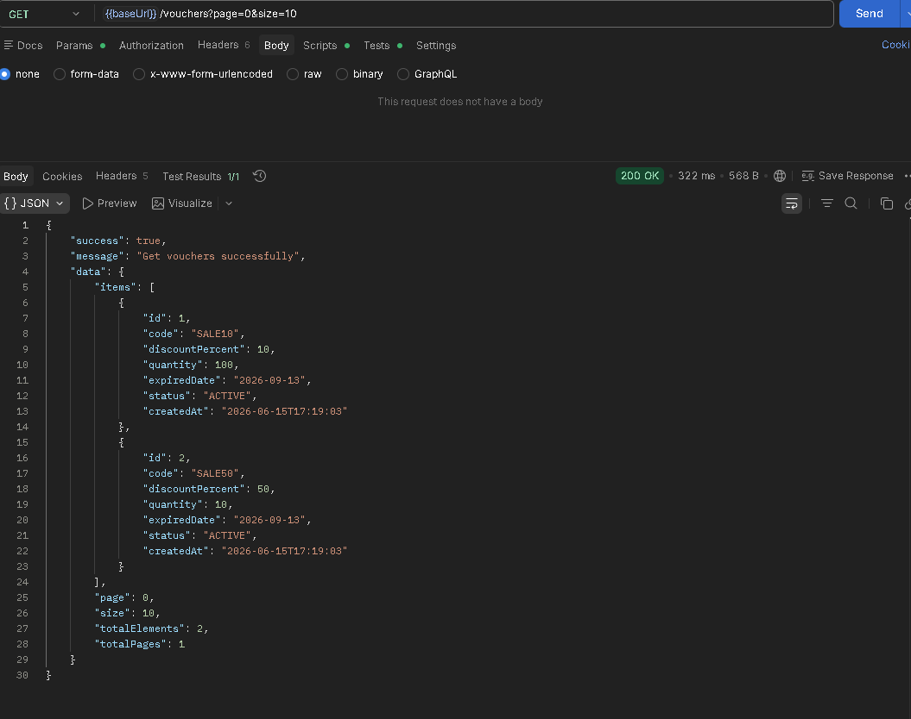

### 2. Tạo voucher mới

```http
POST http://localhost:8080/vouchers
Content-Type: application/json
```

```json
{
  "code": "SALE20",
  "discountPercent": 20,
  "quantity": 50,
  "expiredDate": "2026-12-31",
  "status": "ACTIVE"
}
```

Ảnh Demo:

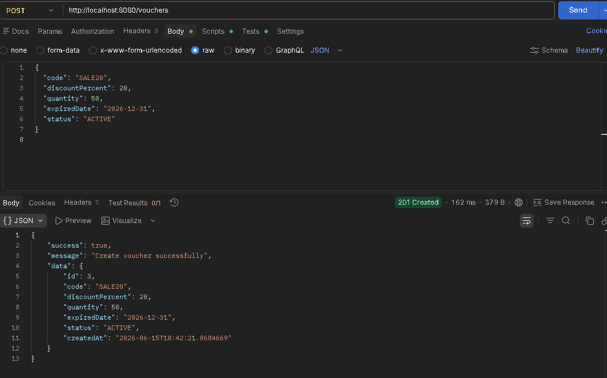

### 3. Validate voucher trùng code

Gửi lại request tạo voucher `SALE20`.

Ảnh Demo:

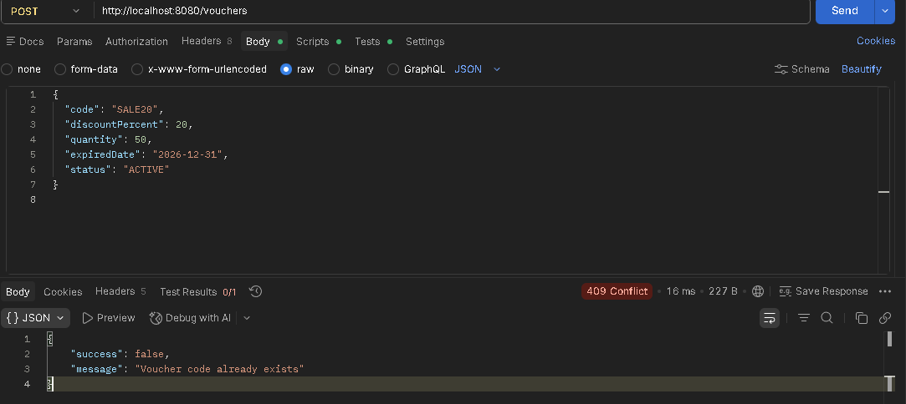

### 4. Validate discount không hợp lệ

```http
POST http://localhost:8080/vouchers
Content-Type: application/json
```

```json
{
  "code": "SALE_INVALID",
  "discountPercent": 0,
  "quantity": 10,
  "expiredDate": "2026-12-31",
  "status": "ACTIVE"
}
```

Ảnh Demo:

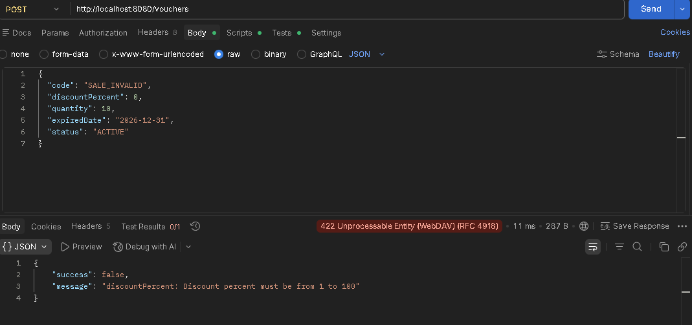

### 5. Tìm kiếm voucher theo code

```http
GET http://localhost:8080/vouchers/search?code=SALE&page=0&size=10
```
Ảnh Demo:

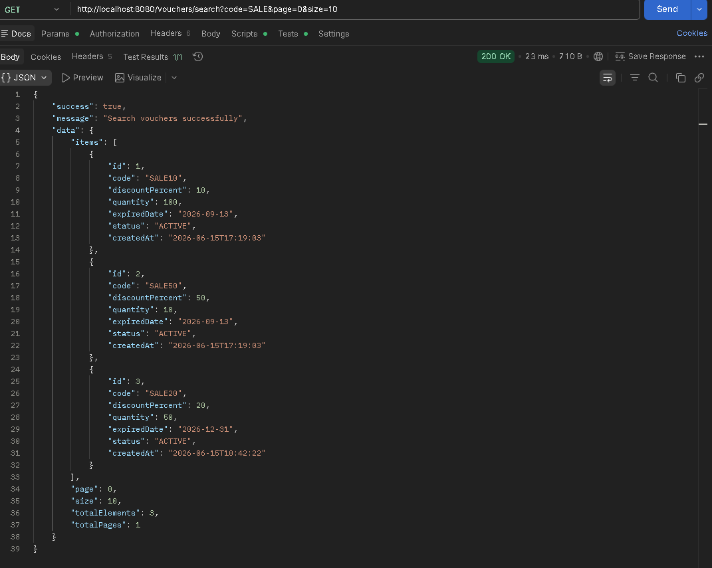

### 6. Cập nhật voucher

```http
PUT http://localhost:8080/vouchers/1
Content-Type: application/json
```

```json
{
  "code": "SALE10",
  "discountPercent": 15,
  "quantity": 99,
  "expiredDate": "2026-12-31",
  "status": "ACTIVE"
}
```

Ảnh Demo:

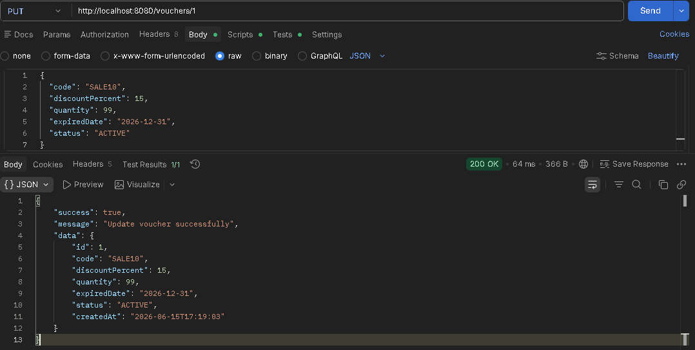

### 7. Lấy danh sách user

```http
GET http://localhost:8080/users?page=0&size=10
```
Ảnh Demo:

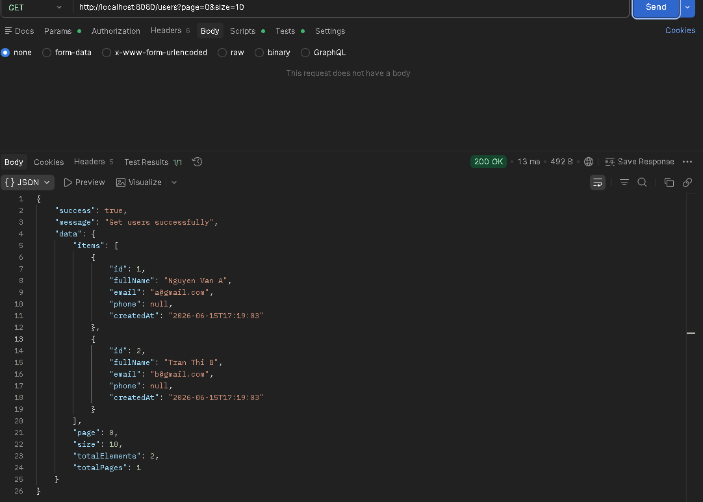

### 8. Tạo user mới

```http
POST http://localhost:8080/users
Content-Type: application/json
```

```json
{
  "fullName": "Le Van C",
  "email": "c@gmail.com",
  "phone": "0909123456"
}
```

Ảnh Demo:

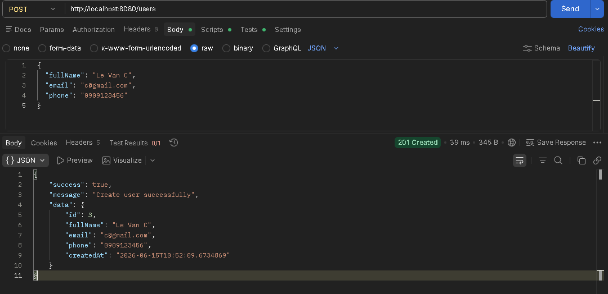

### 9. Validate email trùng

Gửi lại request tạo user với email `c@gmail.com`.

Ảnh Demo:

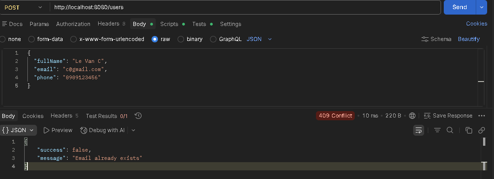

### 10. User sử dụng voucher

```http
POST http://localhost:8080/voucher-usages
Content-Type: application/json
```

```json
{
  "userId": 1,
  "voucherId": 1
}
```

Ảnh Demo:

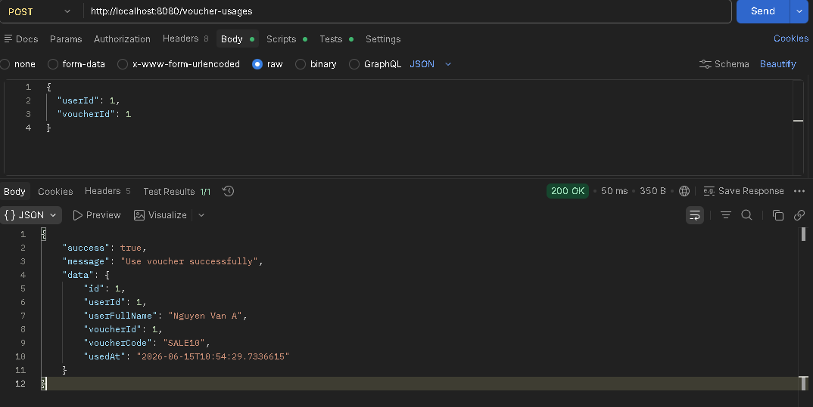

### 11. Xem lịch sử sử dụng voucher

```http
GET http://localhost:8080/voucher-usages?page=0&size=10
```

Ảnh Demo:

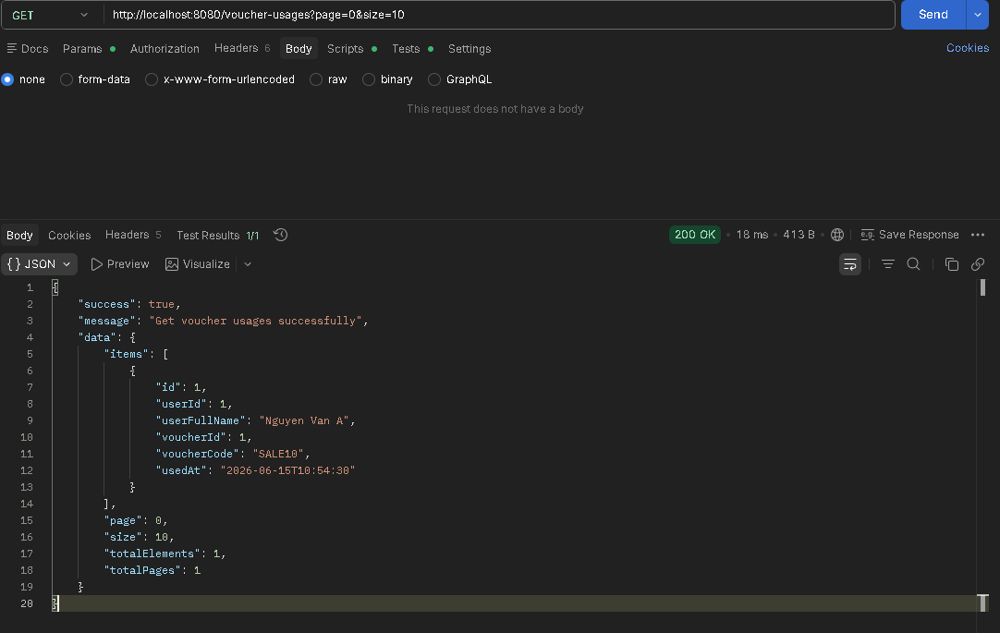

## Quy tắc nghiệp vụ

### Voucher

- `code` bắt buộc nhập và không được trùng.
- `discountPercent` phải nằm trong khoảng từ `1` đến `100`.
- `quantity` phải lớn hơn hoặc bằng `0`.
- `expiredDate` phải lớn hơn ngày hiện tại.
- `status` chỉ nhận `ACTIVE` hoặc `INACTIVE`.
- Không cho xóa voucher đã có lịch sử sử dụng.

### User

- `fullName` bắt buộc nhập.
- `email` bắt buộc nhập, đúng format và không được trùng.
- `phone` có thể để trống.

### Sử dụng voucher

- User phải tồn tại.
- Voucher phải tồn tại.
- Không cho sử dụng voucher đã hết hạn.
- Không cho sử dụng voucher đang `INACTIVE`.
- Không cho sử dụng voucher có `quantity = 0`.
- Khi sử dụng thành công, hệ thống giảm `quantity` của voucher đi `1` và lưu lịch sử vào `voucher_usages`.
- Thao tác sử dụng voucher chạy trong transaction và lock row voucher trước khi giảm số lượng.

## HTTP Status Code

| Status | Ý nghĩa |
| --- | --- |
| `200 OK` | Lấy dữ liệu, cập nhật, tìm kiếm hoặc sử dụng voucher thành công |
| `201 Created` | Tạo user hoặc voucher thành công |
| `204 No Content` | Xóa voucher thành công |
| `404 Not Found` | Không tìm thấy user hoặc voucher |
| `409 Conflict` | Dữ liệu bị trùng, voucher không hợp lệ để sử dụng, hoặc không thể xóa |
| `422 Unprocessable Entity` | Request không hợp lệ |
| `500 Internal Server Error` | Lỗi server ngoài dự kiến |

## Dữ liệu mẫu

Flyway tự thêm dữ liệu mẫu ở migration thứ hai:

| Loại | Giá trị |
| --- | --- |
| Users | `Nguyen Van A <a@gmail.com>`, `Tran Thi B <b@gmail.com>` |
| Vouchers | `SALE10`, `SALE50` |

Voucher mẫu có ngày hết hạn sau 90 ngày tính từ thời điểm chạy migration, nên vẫn dùng được khi setup project mới.

## Ghi chú phát triển

- Controller chỉ xử lý HTTP request và response.
- DTO định nghĩa dữ liệu đầu vào, đầu ra và validate request.
- Service chịu trách nhiệm xử lý nghiệp vụ và transaction.
- Repository chỉ tập trung vào truy vấn dữ liệu.
